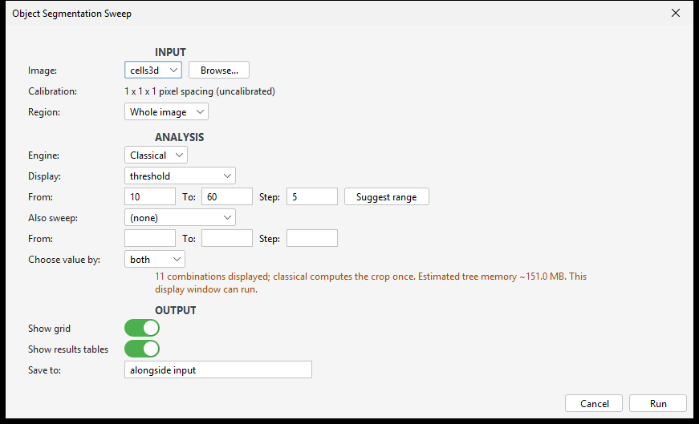
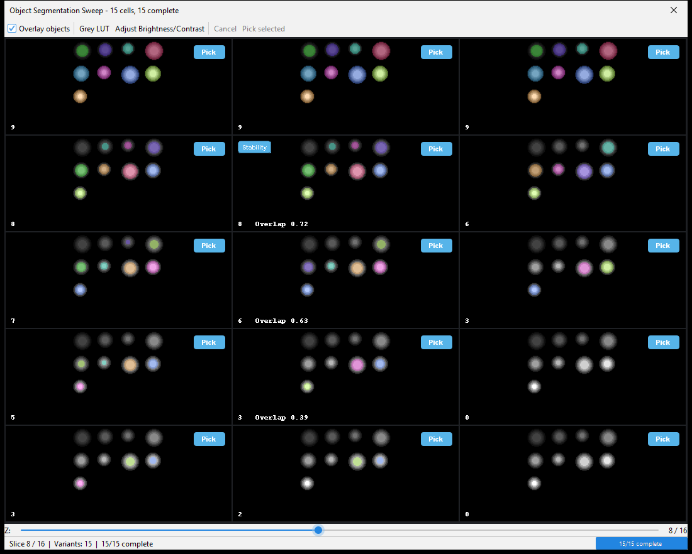

# Object Segmentation Sweep

Object Segmentation Sweep is an ImageJ/Fiji plugin that shows you what a range of segmentation
settings does to your objects, side by side, before you commit to one.

[](https://github.com/Jay2owe/Object-Segmentation-Sweep/actions/workflows/build-main.yml)
[](LICENSE)
<!-- DOI badge: add once a Zenodo DOI is minted for a release. -->

It builds a component tree of the image once, reads every threshold and size combination off that
tree, and lays the resulting label maps out in a grid. Two independent recommendations come with
it: the knee of the object-count curve and the most stable combination by neighbour overlap. Where
they disagree, both are reported. The crop, the values shown and the range used for the knee are
kept in every output so the choice can be reproduced and cited.

## Features

- Sweep one or two axes: threshold, minimum/maximum size, volume, mean/max intensity, elongation,
  surface area, sphericity, compactness, or maximum Feret diameter; further axes page the grid.
- One component tree per image serves every combination, so a sweep does not relabel the image
  for each cell.
- Review per-object coloured overlays in a grid with synchronized Z, hold-to-peek at the raw
  image, Shift-click comparison, and overlay, LUT and brightness controls.
- Knee and neighbour-IoU stability are reported as independent recommendations; disagreement is
  kept rather than silently resolved.
- Sweep inside a crop or selection; its bounds and fraction are written to the tables and the
  picked settings.
- Suggest a threshold range in image units and a size range from 3D component sizes.
- Run from a macro, headless, or from Java through an API that opens no windows and writes no
  files; process folders in batch with regex grouping and optional subfolders.
- Auto-save the tables, the grid image, the picked settings and an optional 16-bit picked label
  map, each folder with its own README.
- Needs only ImageJ at runtime; the shared batch-discovery core is bundled privately in the JAR.

Objects are 26-connected by default, as in 3D Objects Counter+, and a voxel is foreground when its
value is strictly greater than the threshold.

## Installation

### Fiji update site

In Fiji choose **Help > Update... > Manage update sites > Add unlisted site**, enter the name
`Object-Segmentation-Sweep` and the URL

`https://sites.imagej.net/Object-Segmentation-Sweep/`

then **Apply and Close**, **Apply changes**, and restart Fiji. The site opens with its first
upload; until then use the JAR below.

### Manual JAR

Download `Object-Segmentation-Sweep-0.2.0.jar` from the
[GitHub release](https://github.com/Jay2owe/Object-Segmentation-Sweep/releases/tag/v0.2.0), put it
in Fiji's `plugins/` folder and restart Fiji. Install only that JAR: `oc3d-core` is already inside
it, relocated under `segsweep.internal.core`.

The commands appear as **Plugins > Object Segmentation Sweep** and **Plugins > Object
Segmentation Sweep Batch**.

## Requirements

- Fiji or ImageJ 1.x (tested with ImageJ 1.54p).
- Java 8 or newer.
- 8-, 16- or 32-bit grayscale images, 2D or 3D, one channel at a time. Time series are refused.

## Usage



1. Open an image, or use **Browse...** in the dialog.
2. For a multichannel stack, choose the channel. Optionally sweep inside a crop or the current
   selection (the bounding box of a non-rectangular selection is used).
3. Choose an axis and its `From`, `To` and `Step`, or let **Suggest range** propose one. Optionally
   add a second axis.
4. Choose the pick criterion (`knee`, `stability`, `both` or `none`) and what to show and save.
5. Run. Tiles fill in as combinations finish; Escape or closing the grid cancels.
6. Review the grid, then pick a tile yourself with **Pick selected** or its Pick pill.



In the grid, click a tile to select it, hold to peek at the raw image, and Shift-click two finished
tiles to compare them. Left and Right step through Z on every tile at once. A badge marks the
knee or stability pick.

Picked settings and the picked label TIFF are saved only when there is an actual pick: when
criteria disagree, a picker refuses, or `pick=none`, nothing executable is invented, and the pick
summary still records both outcomes.

## Output

Auto-save writes a versioned folder instead of overwriting an existing non-empty result:

```text
Object Segmentation Sweep/
  sweep_results.csv
  pick_summary.csv
  picked_settings.txt          present only when a combination was picked
  grid.png
  README.txt
  labels/
    <image>_picked.tif         present only when a combination was picked
    README.txt
```

`sweep_results.csv` has one row per displayed combination, including object count, calibrated
`Objects_Per_mm3` (blank for 2D), optional `Objects_Per_mm2`, neighbour IoU, eligibility, duration,
crop fraction, and flags. A supported per-cell refusal becomes a `FAILED` row rather than aborting
the other combinations. `SATURATED` means the selected foreground covers the analysed crop.
`TIMED_OUT` is retained in the result schema for execution strategies that define a deadline;
the v0.2 Classical engine has no per-combination timeout setting.

`picked_settings.txt` is the reproducible methods artifact. It contains the classical settings
token, source identity/channel, crop, calibration, displayed axes, both picker reports, and the
actual full-axis range used for the knee computation.

## Macro

```javascript
run("Object Segmentation Sweep",
    "image=[C:/data/image.tif] channel=1 engine=classical " +
    "sweep=threshold from=10 to=60 step=5 pick=both hide_display");
```

Paths may use either slash: backslashes in `image` and `autosave` (as returned by
`getDirectory()` on Windows) are read as forward slashes. `image` names an open window
first, then a file. Values cannot contain `[`, `]` or `"`; this is an ImageJ macro limit.

Options (every key the command accepts):

| Option | Default | Meaning |
| --- | --- | --- |
| `image` | active image | Open-window title or file path |
| `channel` | `1` | One-based channel |
| `engine` | `classical` | The only executable v0.2.0 engine |
| `sweep`, `from`, `to`, `step` | threshold, 10, 60, 5 | Primary axis; each missing value takes its default |
| `values` | none | Explicit comma-separated primary values instead of `from`/`to`/`step` |
| `sweep2`, `from2`, `to2`, `step2`, `values2` | none | Optional secondary axis (no defaults) |
| `crop` | `full` | `full` or `x,y,width,height` |
| `pick` | `both` | `knee`, `stability`, `both`, or `none` |
| `min_crop_fraction` | `0.05` | Warn below this crop fraction |
| `stability_budget_ms` | `0` | Stability time budget; `0` is unlimited |
| `autosave` | beside the input | Explicit output folder |
| `hide_display`, `no_display` | off | Suppress all windows |
| `show_display` | on | Undo an earlier `hide_display` |
| `hide_grid`, `show_grid` | grid shown | Suppress or show the review grid |
| `hide_tables`, `show_tables` | tables shown | Suppress or show the results tables |
| `allow_oversized` | off | Run past the cell-count limits (the memory limit still applies) |

In a macro or headless run a bad option, a refused sweep or Escape stops the calling macro
with a one-line message. An image with no file location and no `autosave` still returns its
result; the Log notes that autosave was skipped.

Batch (`Plugins > Object Segmentation Sweep Batch`) runs every matching file in a folder and
accepts the analysis options above except `image`, `autosave` and the display flags, plus:

```javascript
run("Object Segmentation Sweep Batch",
    "folder=[C:/data] recursive regex=[(.*)_(A\\d+)] group=2 output=[C:/out] " +
    "sweep=threshold from=10 to=60 step=5 pick=both");
```

| Batch option | Default | Meaning |
| --- | --- | --- |
| `folder` | required | Folder to search |
| `regex` | `(.+?)-(.+?)_(.+)\.tif` | Filename pattern; keeps its backslashes |
| `group` | `1` | Capture group that varies within a comparable set |
| `output` | inside `folder` | Where the `Object Segmentation Sweep` output folder is created |
| `recursive` | off | Include subfolders |

Each file shows `n/N <file>` in the status bar; Escape stops after the current image and keeps
finished results. Unreadable files are listed in `batch_failures.csv`.

## Java API

```java
SegSweepParameters parameters = SegSweepParameters.builder()
        .image(image)
        .channel(1)
        .axis(ParameterId.THRESHOLD, 10, 60, 5)
        .pickCriterion(SegSweepParameters.PickCriterion.BOTH)
        .build();

SegSweepResult result = SegSweep.run(parameters);
ResultsTable sweep = result.sweepTable();
if (result.pickedLabelMap() != null) {
    ImagePlus labels = result.pickedLabelMap().get();
}
```

`SegSweep.run` opens no dialogs, shows no windows, and writes no files. Pass the source
`ImagePlus` directly. `SegSweepBatchRunner` provides the folder-level API.

## How it works

**One tree, many cuts.** The image (or crop) is turned into a max-tree once: voxels are added from
the brightest value down, and each time connected regions merge a node records the component's
size, intensity, bounding box, surface and shape moments. Any threshold is then a cut through that
tree: the objects above a threshold are the highest nodes whose level is above it. A sweep of
fifty thresholds reads fifty cuts instead of labelling the image fifty times.

**Filters are node tests.** Size and morphology limits (volume, mean or max intensity, elongation,
surface area, sphericity, compactness, Feret diameter) are checked on each node in the cut, using
the node's own measured value, the same way 3D Objects Counter+ filters its objects after
labelling. Exact Feret diameters are computed only for candidates that pass the cheaper tests.

**Label maps are made on demand.** A combination keeps only the IDs of its selected nodes. Label
images are written when a tile is drawn, a slice is shown or a pick is saved, and a tile only
paints the objects that reach the slice on screen.

**Knee.** Object counts are computed across the whole threshold axis, not just the displayed
steps. Both axes of the count curve are scaled to 0-1 and the knee is taken at the largest bend,
where the curve sits furthest from the straight line joining its ends. Flat curves, fewer than four points and
two-axis sweeps are refused with a reason rather than forced.

**Stability.** For each combination with a full set of grid neighbours, the plugin measures the
intersection-over-union of its foreground with each neighbour's and averages them. The
combination with the highest mean is the most stable; edge tiles without a full set of neighbours
are not scored. A time budget (`stability_budget_ms`) can bound this step.

## Building from source

Java 8 or newer is required. The build pins `io.github.jay2owe:oc3d-core:0.1.0`, which is not in a
public Maven repository, so build its `v0.1.0` tag first:

```bash
git clone --branch v0.1.0 --depth 1 https://github.com/Jay2owe/oc3d-core.git
mvn -f oc3d-core/pom.xml clean install
bash mvnw clean verify
```

On Windows:

```powershell
git clone --branch v0.1.0 --depth 1 https://github.com/Jay2owe/oc3d-core.git
mvn -f oc3d-core/pom.xml clean install
.\mvnw.cmd clean verify
```

The plugin is written to `target/Object-Segmentation-Sweep-0.2.0.jar`. `verify` also loads the
packaged JAR in an isolated class loader to check the relocated core, and GitHub Actions repeats
the same bootstrap from a fresh checkout.

## Known limitations

- Knee and stability are heuristics, not proofs of an optimal segmentation.
- There is no randomization null model, so the plugin cannot say whether a knee differs from
  chance.
- The classical engine is the only engine; StarDist and Cellpose are not included.
- Time series are refused; split the timepoints and analyse each frame.
- Knee scoring is one-dimensional and is refused when two axes vary.
- Surface area in a 2D image counts the top and bottom faces of each pixel (a 3x2 rectangle has
  surface 22) and is in pixel units; calibration is not applied. 3D surface area is also in voxel
  faces. Sphericity and compactness use the same definition.
- Label colours in the grid repeat every 255 labels, so two distant objects can share a colour.
- Stability cost grows with the number of tiles and object sizes; use `stability_budget_ms` on
  large sweeps.
- Exact Feret evaluation is limited to 4096 voxels per candidate; combinations that need more are
  reported as failed rows.
- The review grid and auto-saved montages hold at most 100 tiles. Java API runs may return larger
  tables but are refused above 10,000 combinations or 250 million combination-voxel queries.
- Results depend on the recorded crop, displayed values and knee range.
- `Duration_ms` is wall-clock time and varies between identical runs.

## Citing

See [`CITATION.cff`](CITATION.cff) (GitHub's "Cite this repository" button reads it). Until an
archived DOI is minted, cite the version and source:

> Malcolm, J. (2026). Object Segmentation Sweep (v0.2.0) [Software]. GitHub.
> https://github.com/Jay2owe/Object-Segmentation-Sweep

Suggested methods sentence:

> Segmentation thresholds were reviewed with Object Segmentation Sweep (v0.2.0), recording the
> object-count knee and neighbour-IoU stability together with the crop and parameter range;
> object-based colocalization was measured with CPC (v1.4.0).

Please also cite Fiji (Schindelin et al., 2012) and ImageJ (Schneider et al., 2012).

## Related plugins

Object Segmentation Sweep chooses the settings that produce label images for downstream analysis:

- [Centre-Particle Coincidence (CPC)](https://github.com/Jay2owe/CPC) measures object-based
  colocalization from label images or ROI sets.
- [3D Objects Counter+](https://github.com/Jay2owe/3DObjectsCounterPlus) counts and measures 3D
  objects with matching morphology measures and the same connectivity default.

For sweeping preprocessing filter chains rather than segmentation settings, see
[Macro Builder](https://sites.imagej.net/Macro-Builder/).

## Acknowledgements

Developed by Jamie Malcolm in the [Brancaccio Lab](https://www.ukdri.ac.uk/labs/brancaccio-lab)
at the [UK Dementia Research Institute](https://ukdri.ac.uk/centres/imperial), Imperial College
London.

This work was supported by the UK Dementia Research Institute, which receives its core funding
from the UK Medical Research Council, the Alzheimer's Society, and Alzheimer's Research UK.

Built on [Fiji](https://fiji.sc/) and [ImageJ](https://imagej.net/).

## License

BSD 3-Clause License. See [`LICENSE`](LICENSE).
